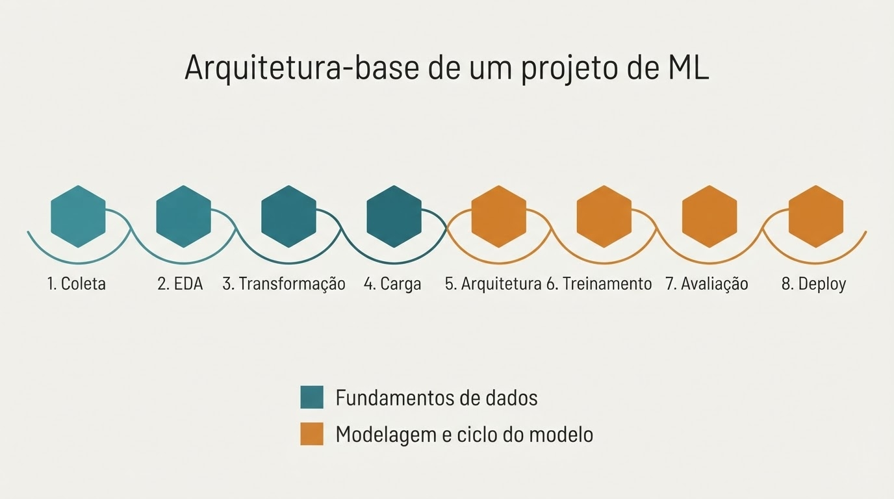

import ConfusionMatrixDemo from '../../components/ConfusionMatrixDemo.jsx'

Antes de falar de qualquer peça isolada (dado, modelo, treinamento), vale desenhar o mapa inteiro uma vez. É fácil aprender fragmentos e nunca ver como eles se encaixam, nem onde cada decisão te compromete lá na frente. Este post é esse mapa, com os tradeoffs reais de cada etapa. Os próximos da série vão aprofundar cada uma.

**Uma nota antes de começar:** os exemplos usados ao longo do texto (e a simulação interativa mais adiante) giram em torno de um cenário hipotético de detecção de fraude em transações. Não é um dataset real nem um projeto específico; é só um fio condutor para tornar cada etapa concreta em vez de abstrata. A lógica se aplica a qualquer domínio supervisionado e fraude é só o exemplo que atravessa o texto inteiro.

## 1. Coleta / Extração

De onde os dados vêm: bancos, APIs, arquivos, streams. Mas antes de coletar, existe uma pergunta que costuma ser pulada: o que exatamente define o seu label? Todo problema supervisionado depende de uma definição operacional do que está sendo previsto, e essa definição raramente é óbvia. Em fraude, "transação fraudulenta" parece claro, mas você decide *quando* ela vira fraude: no momento da transação, na confirmação do chargeback, dias depois? Essa escolha muda o dataset inteiro, e um label mal definido contamina todas as etapas seguintes sem dar sinal de que algo está errado.

## 2. EDA (Exploração)

Entender o que foi coletado antes de tocar nele, como a distribuição, faltantes, desbalanceamento. Aqui mora um risco silencioso: correlação espúria, quando uma variável parece preditiva só por coincidência estrutural, não por relação causal real. Pode ser um viés de amostragem, um artefato do pipeline, ou pior: um campo que só é preenchido *depois* que a fraude já foi confirmada, vazando informação do futuro para dentro do treino. EDA não é só olhar os dados, é desconfiar do que parece bom demais.

## 3. Transformação / Feature Engineering

Limpar, normalizar, criar variáveis, tratar desbalanceamento. O entendimento da EDA vira decisão técnica e é aqui que a correlação espúria identificada na etapa anterior é removida ou isolada, antes que ela vaze pro modelo e infle métricas que não vão se sustentar em produção.

## 4. Carga / Preparação para treino

Dataset final, splits de treino/validação/teste. Quando existe qualquer componente temporal (e fraude quase sempre tem) split aleatório não é a mesma coisa que split temporal. Treinar com dado do futuro para prever o passado é outra forma de vazamento, só que mais difícil de perceber porque as métricas de validação continuam parecendo boas.

## 5. Escolha e definição da arquitetura

Que tipo de modelo faz sentido para o padrão dos dados? E escolher errado aqui custa mais do que uma métrica mais baixa. Dado transacional, sem dependência sequencial real, forçado dentro de um transformer desperdiça capacidade computacional procurando um padrão que não existe, e pode performar pior que um modelo mais simples como XGBoost. O tradeoff não é só acurácia: é complexidade, custo de treino e manutenção sem ganho correspondente.

## 6. Treinamento

O loop de ajuste de pesos (loss, gradiente, learning rate — o motor de um post futuro). Antes do motor em si, existe uma decisão de ensino: o modelo aprende exatamente o que o seu esquema de label ensina ele a aprender, nada mais. Em vez de marcar só a transação fraudulenta final, propagar o label para as transações precursoras ensina o modelo a reconhecer o padrão de preparação da fraude, não apenas o momento do golpe. Isso muda o que o modelo é capaz de prever, e quando.

## 7. Avaliação

Métricas certas para o problema certo. Essa etapa não existe isolada: ela precisa conversar com o que foi ensinado no treino e com o que vai acontecer no deploy. Recall vs. precision não é escolha abstrata, é sobre o custo real de cada tipo de erro: bloquear uma transação legítima custa diferente de deixar passar uma fraude, e essa assimetria deveria ter sido pensada desde a definição do label, não descoberta só agora, na avaliação.

Para sentir esse tradeoff na prática, em vez de só ler sobre ele: abaixo tem uma matriz de confusão interativa, simulando o cenário de detecção de fraude. Mexa no threshold de decisão e observe o que acontece: recall e precision puxam em direções opostas, e não existe ponto que maximiza os dois ao mesmo tempo.

<ConfusionMatrixDemo client:load />

Repare no que acontece nos extremos: com o threshold muito baixo, o modelo vira um "gatilho fácil": captura quase toda fraude, mas maioria dos alertas é falso positivo. Com o threshold muito alto, o oposto: só passa o que é caso muito óbvio, poucos falsos positivos, mas a maior parte da fraude escapa. A escolha do threshold ideal não é técnica, é de negócio, pois depende de quanto custa cada tipo de erro no seu contexto.

## 8. Deploy / Monitoramento

O modelo em produção, e o que acontece quando os dados reais divergem dos dados de treino. Em vez de substituir o sistema antigo de uma vez, faz sentido rodar o novo modelo em paralelo (shadow mode) depois liberar para uma fração do tráfego, comparando resultado real antes de assumir 100%. É a forma de descobrir problemas de generalização com blast radius controlado, em vez de descobrir tudo de uma vez com o sistema inteiro exposto.

## A ideia central

Cada etapa consome a saída da anterior, e cada decisão carrega uma suposição que só é testada etapas depois. Pular uma, ou tomar a decisão errada nela, é a causa mais comum de projeto de ML que não funciona, e não porque o modelo era ruim, mas porque a pergunta errada foi respondida com precisão.

**Uma ressalva antes de seguir:** este é o fluxo canônico, o caminho didático para entender as peças. Na prática, ele raramente é linear: existem loops de volta, e variações inteiras como fine-tuning, AutoML, aprendizado contínuo e foundation models seguem pipelines próprios. Isso vira o próximo post da série.

---

## Glossário

**AutoML**: abordagem em que a busca por arquitetura e hiperparâmetros é automatizada, em vez de decidida manualmente antes do treino.

**Blast radius**: o quanto um problema pode afetar quando algo dá errado; em deploy, quanto menor o blast radius de uma falha, menor o impacto real.

**Correlação espúria**: quando uma variável parece preditiva por coincidência estrutural (viés de amostragem, artefato de pipeline), não por relação causal real com o que está sendo previsto.

**EDA (Exploratory Data Analysis / Análise Exploratória de Dados)**: etapa de entender o que existe nos dados — distribuição, valores faltantes, desbalanceamento — antes de qualquer transformação ou modelagem.

**Fine-tuning**: ajustar um modelo já pré-treinado numa fração dos dados/pesos, em vez de treinar uma arquitetura do zero.

**Gradiente**: a derivada da loss em relação a cada peso do modelo; indica a direção e a magnitude do ajuste necessário para reduzir o erro.

**Label**: a resposta certa que o modelo aprende a prever; sua definição operacional (o quê, quando, como é atribuído) molda todo o resultado do projeto.

**Learning rate**: o tamanho do passo dado na direção indicada pelo gradiente a cada atualização de peso.

**Loss (perda)**: número que mede o quão errado o modelo está numa previsão; o único sinal que orienta o treinamento.

**Recall**: de tudo que era realmente positivo (ex: fraude de verdade), qual fração o modelo conseguiu identificar. Prioriza não deixar passar casos verdadeiros.

**Precision**: de tudo que o modelo marcou como positivo, qual fração realmente era. Prioriza não gerar alarmes falsos.

**Shadow mode**: rodar um modelo novo em paralelo ao sistema em produção, sem tomar decisões reais, só para comparar resultados antes de liberar tráfego real para ele.

**Split (treino/validação/teste)**: divisão do dataset em partes separadas: uma para treinar o modelo, outra para ajustar decisões durante o desenvolvimento, e uma última para avaliar o resultado final sem viés.

**Split temporal**: divisão que respeita a ordem cronológica dos dados (treino com o passado, teste com o futuro), evitando que o modelo "veja" informação que só existiria depois do momento que está tentando prever.

**Vazamento de dados (data leakage)**: quando informação que só estaria disponível depois do momento da previsão acaba entrando no treino, inflando métricas de forma artificial.

**XGBoost**: algoritmo de gradient boosting sobre árvores de decisão, frequentemente forte em dados tabulares sem dependência sequencial.
