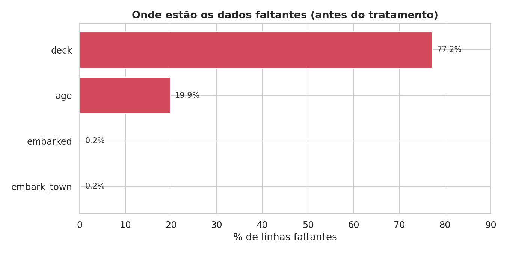
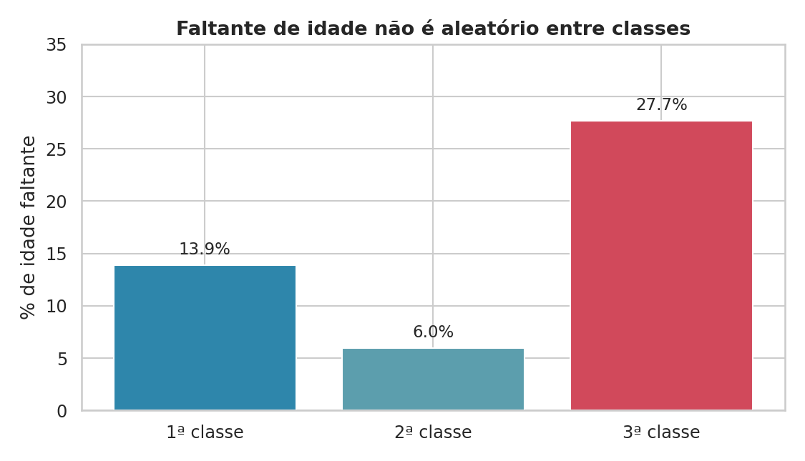
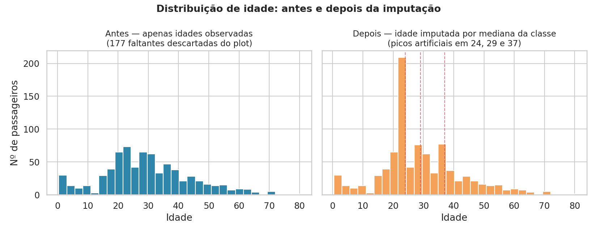
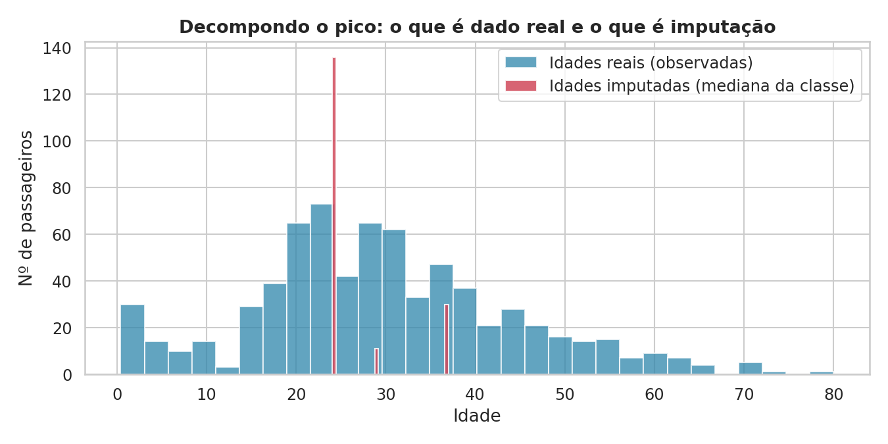
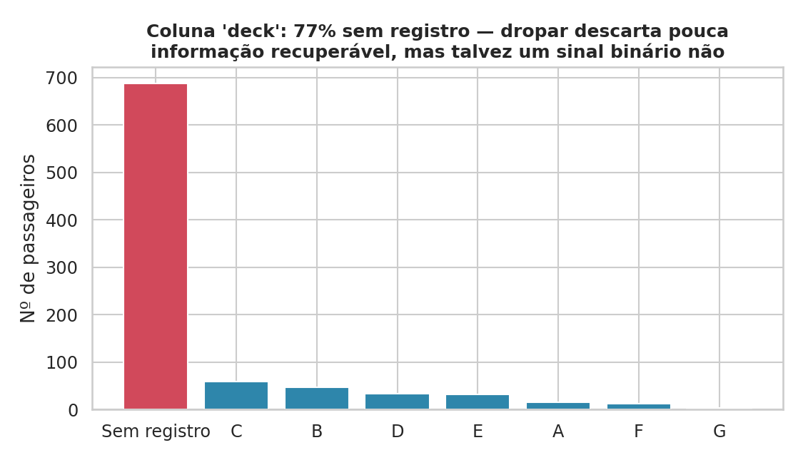

# EDA na prática: o diagnóstico que quase mentiu

Etapa 2 do fluxo canônico de um projeto de ML: entender o que foi coletado antes de tocar nele. É diagnóstico, não conserto. Na teoria isso soa direto. Na prática, o diagnóstico pode te enganar, inclusive depois de você mesmo já ter "corrigido" o problema. Este post mostra um caso real disso, passo a passo, usando o dataset Titanic como exercício guiado, com o antes e depois de cada decisão.

---

## Que problema a EDA resolve, afinal

Todo modelo aprende exatamente o que os dados de treino mostram a ele, sem exceção. Se os dados carregam um viés, uma duplicação de informação ou um artefato criado durante o próprio tratamento, o modelo aprende esse ruído como se fosse padrão real, com a mesma confiança que aprenderia um padrão verdadeiro. Ele não tem como distinguir os dois.

É esse o problema que a EDA existe para resolver: reduzir a distância entre o que você acha que os dados representam e o que eles de fato representam, antes que essa distância vire decisão de arquitetura, de feature engineering ou de métrica de avaliação. Cada achado desta etapa vira insumo direto da próxima: saber que `age` falta de forma desigual entre classes muda como a imputação é feita; saber que a imputação criou um pico artificial muda que colunas entram no modelo e como a distribuição deve ser lida dali para frente. Pular essa etapa, ou tratá-la como uma lista de passos a marcar como concluída, não elimina o problema: só adia a descoberta dele para depois do modelo já estar treinado, quando é mais caro corrigir.

---

## 1. Primeiro, ver onde os dados estão faltando

Antes de qualquer tratamento, o dataset (891 passageiros) tem faltantes concentrados em três colunas:

`deck` falta em 77% dos registros, `age` em quase 20%, e `embarked` em apenas 2 linhas, praticamente irrelevante. Já dá para perceber que cada uma dessas colunas vai pedir uma decisão diferente: o volume de faltante muda completamente o que é seguro fazer.

Antes de decidir isso, vale notar outra coisa que aparece na inspeção inicial: o dataset tem colunas duplicadas. `pclass` (1/2/3) é a mesma informação que `class` (First/Second/Third), e `embarked` (S/C/Q) é a mesma coisa que `embark_town` (Southampton/Cherbourg/Queenstown). Nenhuma das duas é erro, mas usar as duas versões como se fossem sinais independentes é redundância disfarçada de informação nova.

---

## 2. Nem todo faltante é aleatório, e isso muda o tratamento

A tentação com `age` é imputar a mediana geral e seguir em frente. Mas antes de qualquer imputação, a pergunta certa é: **esse faltante é aleatório, ou está relacionado a outra coisa que eu já sei sobre o passageiro?**

A resposta é clara: a 3ª classe tem quase 5 vezes mais faltante de idade que a 2ª. Isso não é ruído, é um padrão. Imputar com a mediana geral penalizaria justamente o maior grupo do navio com um valor que não reflete a realidade dele. A correção é imputar por grupo, com a mediana calculada dentro de cada classe, não no dataset inteiro.

---

## 3. A virada: a correção criou um problema novo

Depois de imputar `age` por mediana de classe, o histograma da idade mostrou um pico artificial que não existia nos dados originais:

À esquerda, a distribuição real, só com passageiros que tinham idade registrada. À direita, depois da imputação, aparece um pico bem acima do esperado, marcado pelas linhas tracejadas em 24, 29 e 37 anos. Não é coincidência: são exatamente as três medianas usadas no tratamento. Cada faltante virou um valor idêntico ao dos outros da mesma classe, e isso empilhou centenas de passageiros no mesmo ponto do histograma.

Decompondo o gráfico, dá para ver exatamente o tamanho da distorção:

A barra vermelha, de valores imputados, não é um detalhe pequeno: ela domina uma faixa inteira da distribuição. Qualquer leitura feita sobre "a idade média dos passageiros" ou "a forma da distribuição de idade" depois da imputação, sem separar o que é real do que é imputado, estaria lendo em parte um artefato criado pelo próprio tratamento.

---

## 4. E se cada faltante fosse tratado diferente? Uma tabela de cenários

A tabela abaixo resume, para cada coluna problemática, o que aconteceria em diferentes decisões de tratamento, incluindo não tratar nada.

| Coluna | Cenário | O que acontece | Risco |
|---|---|---|---|
| **age** | Não tratar (deixar faltante) | Muitos modelos não aceitam `NaN`; linhas com faltante seriam descartadas | Perde 20% dos dados, e não aleatoriamente: perde mais 3ª classe |
| **age** | Imputar com mediana **global** | Todo faltante vira o mesmo valor único (a mediana geral) | Penaliza a 3ª classe, que tem o faltante mais alto e o perfil de idade mais diferente |
| **age** | Imputar com mediana **por classe** *(o que foi feito)* | Faltante vira a mediana da própria classe do passageiro | Mais realista, mas cria picos artificiais na distribuição; precisa de flag para não contaminar análises futuras |
| **age** | Criar apenas o flag, sem imputar | Preserva o sinal "faltava" sem inventar valor | Ainda exige alguma estratégia para o modelo lidar com o `NaN` |
| **deck** | Dropar a coluna inteira *(o que foi feito)* | Remove 100% do problema, e 100% da informação | Perde-se um possível sinal indireto (classe alta tende a ter cabine registrada) |
| **deck** | Imputar algum valor | Preenche 77% do dataset com um valor sem base real | Cria uma "categoria" majoritária inventada, distorce qualquer análise por deck |
| **deck** | Virar sinal binário (tem registro ou não) | Mantém o sinal sem inventar categoria | Precisa validar se esse sinal realmente carrega informação útil, ou é só correlação com classe |
| **embarked** | Dropar as 2 linhas *(o que foi feito)* | Perde 0,2% do dataset | Praticamente nenhum |
| **embarked** | Imputar com a moda | Preenche com o porto mais comum | Baixo risco dado o volume ínfimo, mas é esforço desnecessário para 2 linhas |

O padrão que essa tabela deixa claro é que não existe tratamento neutro. Toda decisão, inclusive não tratar, tem um efeito colateral. A pergunta não é "qual é o jeito certo de imputar", é "qual efeito colateral eu prefiro carregar, sabendo exatamente qual é ele?".

---

## 5. O que sobrou visível mesmo depois da correção

Vale fechar com `deck`, que ilustra o mesmo princípio de outro ângulo:

A barra vermelha, de registros ausentes, é maior que todas as outras juntas. Dropar a coluna foi a decisão mais segura aqui, mas o gráfico também mostra o que se perde: seja lá o que causava esse registro, provavelmente cabines eram mais documentadas para passageiros de classes mais altas, esse sinal desaparece junto.

---

## O hábito que evita cair nisso de novo

Antes de sobrescrever qualquer coluna com valor imputado, vale guardar um marcador simples indicando quais linhas foram alteradas. Com isso, qualquer gráfico ou análise feita depois pode escolher excluir os valores imputados e mostrar a forma real dos dados, sem o ruído da própria correção aparecendo como se fosse padrão dos passageiros.

## Isso é toda a EDA? Não, é uma fatia dela

O que foi coberto aqui, tratamento de faltantes e o que ele revela sobre os dados, é uma parte da etapa, não a etapa inteira. Ainda faltam: a distribuição de tarifa (`fare`), o cruzamento de cada variável com a sobrevivência, a matriz de correlação e a checagem de outliers, antes de qualquer hipótese de modelagem. Isso fecha o próximo post da série, quando os achados desta etapa começam a virar decisões concretas de feature engineering.

Mesmo sendo só um pedaço do processo, já dá pra tirar uma lição que vale por si só.

A lição que fica desse pedaço, sozinha, já vale o post: EDA não é uma lista de passos marcados como concluídos. É desconfiar do próprio resultado, inclusive do que você mesmo acabou de produzir.
