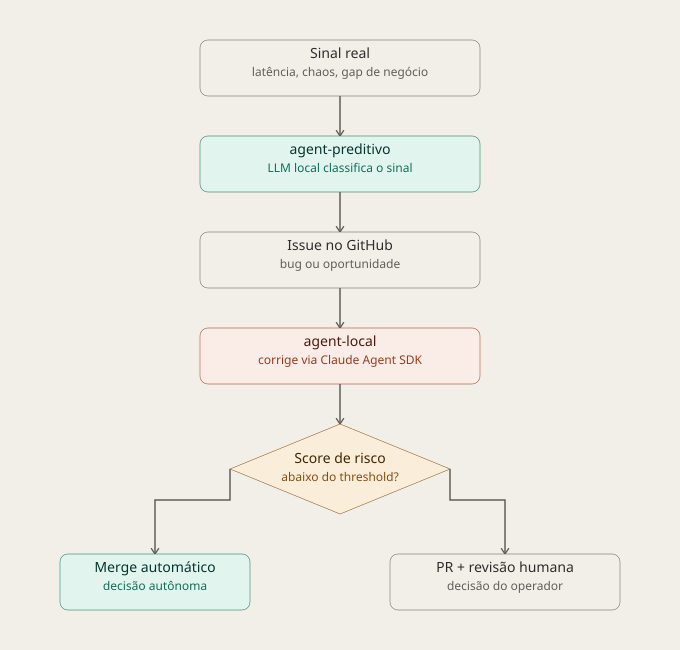

Nos últimos dias rodei três janelas de validação real no `bank-of-decoy`, um projeto pessoal que simula um domínio de pagamentos PIX (quatro microsserviços, chaos engineering, e uma camada de agentes autônomos que detecta problemas, corrige código e decide sozinha entre subir a correção ou pedir revisão humana). Este artigo cobre o que essas três janelas mostraram, sem esconder o que não funcionou.

## Contexto e escopo da solução

Antes de tudo, um aviso importante: o fluxo de domínio PIX simulado aqui é **fictício e propositalmente simplificado** — uma fração pequena de um sistema real de pagamentos instantâneos. Não há regulatório do Banco Central (SPI, DICT), não há os call codes reais de liquidação e devolução, não há requisitos não funcionais de produção (SLA de disponibilidade, resiliência exigida por regulador), não há PLD/prevenção à lavagem de dinheiro, não há motor de fraude real, e não há as inúmeras checagens de consistência entre contas/saldos/limites que um sistema de pagamentos de verdade precisa ter. O objetivo do projeto nunca foi reproduzir esse domínio com fidelidade — foi ter um domínio complexo o suficiente (múltiplos serviços, estado assíncrono, caminhos de erro) para servir de terreno de teste realista para a camada de agentes autônomos, que é o que este artigo de fato cobre.

A arquitetura tem quatro microsserviços de domínio (onboarding, conta, chave PIX, transação), cada um com seu próprio banco, conectados por mensageria assíncrona (Kafka) e observados via Prometheus/Grafana. Sobre isso, três camadas adicionais:

- **Chaos engineering sob demanda**: um orquestrador injeta falhas controladas (degradação progressiva, atraso de fila, corrupção sutil de payload) via um endpoint interno em cada serviço.
- **Agente preditivo**: um único daemon que, a cada 5 minutos, consulta métricas e logs, usa um LLM local (Ollama, `llama3.2:3b`) para classificar sinais como bug ou oportunidade de negócio, e abre issues formatadas no GitHub.
- **Agente local**: outro daemon, que consome essas issues, implementa a correção via Claude Agent SDK dentro de um clone isolado do repositório, roda os testes, calcula um score de risco determinístico (não é o LLM que decide isso) e, dependendo do score e da criticidade do serviço, faz merge automático ou abre PR para revisão humana.

Este artigo cobre só essa trilha (a solução com agentes). Uma segunda trilha, ainda não iniciada, vai cobrir a geração do dataset de fraude e a modelagem de ML sobre ele.

### Arquitetura atual

A solução tem quatro camadas: os microsserviços de domínio, o `agent-preditivo` (detecção), o `agent-local` (correção e decisão), e o GitHub como ponto de integração entre os dois agentes.

Um ponto que vale destacar: existe uma assimetria real entre os dois agentes. O `agent-preditivo` commita e dá push direto em `main` para publicar specs de negócio, sem PR e sem revisão — enquanto o `agent-local` passa por um clone isolado, testes e um gate de risco rigoroso antes de qualquer merge. É uma decisão de design (a spec precisa existir no remoto antes da issue ser criada), mas é também a mesma classe de escrita sem isolamento por trás de um bug real encontrado na terceira janela.

O diagrama completo, com todos os componentes de infraestrutura, chaos engineering e os quatro desfechos possíveis do gate de risco, está documentado em [`docs/escopo-arquitetura.md`](https://github.com/jcorreaviana/bank-of-decoy/blob/main/docs/escopo-arquitetura.md) no repositório.

### Regras de score e decisão

O gate de risco do `agent-local` é determinístico, não é o LLM que decide:

1. **Criticidade do serviço** (peso maior, fixo por tier): crítico — `transaction-service`/`pix-key-service` — tem threshold mais baixo e rigoroso; alto — `account-service`/`onboarding-service` — é mais permissivo; baixo (observabilidade/infra) tem o threshold mais alto.
2. **Categoria da mudança** (modulador, não soma linear): mudança em regra de negócio eleva o score, empurrando para revisão humana mesmo em serviço de baixo risco. Ajuste puramente operacional (log, timeout, mensagem de erro) reduz o score, desde que não altere comportamento observável.
3. **Cobertura de teste**: quanto menor, maior o score.
4. **Tamanho do diff**: diffs maiores ou multi-arquivo aumentam o score.

Threshold final varia por tier — mais rigoroso em serviço crítico do que em serviço de tier alto.

## Resultados alcançados

| Janela | Data | Duração | Issues processadas | Decisões |
|---|---|---|---|---|
| 1 | 26/08 → 28/08 | ~2h | 5 | 1 `autonomo`, 4 travadas por gaps de design |
| 2 (Fase 2b) | 30/08 | 2h13min | 9 | 0 `autonomo`, 2 `humano` (mergeados manualmente), 7 `no_action_needed` (3 com diff vazado para a working tree real), 1 `agent-stuck` |
| 3 (rerun) | 01/09 | 2h06min | 6 | 2 `autonomo` (primeira vez de ponta a ponta), 3 `humano`, 1 `no_action_needed` |

No repositório inteiro: 85 issues no total (82 fechadas, 3 abertas), 12 PRs (10 mergeados, 2 fechados sem merge por serem validações temporárias).

**Exemplos reais de auditoria** (tabela `risk_decisions`, um por tipo de decisão):

- **`autonomo`** — issue #99: score 24.47/threshold 40 (tier alto), decidida em ~2 minutos ponta a ponta, PR #102 mergeado sem revisão humana, custo de SDK $0.19.
- **`humano`** — issue #71 (Janela 2): score 42.59/threshold 20 (tier crítico), 13m32s até a decisão, mais 51m21s de espera até a revisão manual.
- **`no_action_needed`** — issue #94 (Janela 3): score 42.00/threshold 20, sem diff a aplicar, issue comentada e fechada diretamente, sem PR.
- **`agent-stuck`** — issue #61 (Janela 2): nunca chegou a calcular score. Uma falha real (erro novo do SQLAlchemy) foi seguida por duas colisões mecânicas de branch órfã, escalando para intervenção humana em 10m19s.

A progressão entre as três janelas conta a história por si: da primeira decisão autônoma isolada, passando por uma janela onde o próprio mecanismo de teste falhou antes de testar qualquer coisa de fato, até chaos real confirmado e o primeiro ciclo `autonomo` reproduzível.

## Desafios e oportunidades identificadas (e resolvidas) entre execuções

- **Recuperação de falha pós-atribuição** (Janela 1 → corrigido): sem tratamento de exceção geral, uma falha depois do agente se auto-atribuir a uma issue deixava ela travada, sem devolução à fila.
- **PR incondicional sem diff** (Janela 1 → corrigido): o agente tentava abrir PR mesmo sem mudança real, travando em vez de simplesmente registrar que não havia ação necessária.
- **Resultado da suíte de testes não influencia o gate** (Janela 1 → ainda não corrigido): confirmado no código atual — uma suíte falhando não impede merge automático se cobertura/diff derem um score baixo. Ainda sem issue formal aberta para isso.
- **Path relativo resolvido contra o diretório de trabalho errado** (Janela 2): invalidou todo o teste de caos daquela janela. Quarenta ciclos, zero caos injetado — só descoberto por correlação manual contra o Prometheus, não por qualquer alarme do próprio sistema.
- **Vazamento de isolamento, em três canais distintos ao longo do projeto**: primeiro, uma variável de ambiente de sessão de IDE herdada pelo subprocesso do agente; depois, a ferramenta de edição do SDK sem checagem de caminho (taxa caiu de 30% para 0% nesse canal específico após a correção). Nesta última janela, um terceiro canal, sem relação com os dois anteriores: o `agent-preditivo` nunca teve isolamento nenhum no caminho de escrita de arquivos de cenário de teste, gravando direto no repositório real sempre que o modelo rejulga um cenário como uma oportunidade válida. Diagnosticado, correção planejada para depois.
- **Branch órfã mascarando falha real como travamento do agente**: corrigido primeiro no caminho de "sem ação necessária", depois num segundo caminho de falha genérica que a primeira correção não cobria.
- **Cold start manual em múltiplos terminais → automatizado**: um único script sobe o ambiente inteiro, espera health checks reais (não um tempo fixo), aplica as migrations corretas, e os dois daemons agora nascem isolados por design (via agendador de tarefas do sistema operacional), não por disciplina do operador lembrando de usar um terminal limpo.
- **Score de risco interpretando negação como confirmação**: uma issue que mencionava "nenhuma regra de negócio alterada" no corpo tinha o score elevado exatamente pela correspondência textual da frase que deveria isentá-la — descoberto ao vivo, documentado com correção recomendada, ainda pendente de implementação.

## Tempo médio do projeto

Do primeiro commit até a terceira janela de validação (o primeiro ciclo `autonomo` reproduzível de ponta a ponta): **6 dias corridos**. Nesse intervalo: arquitetura completa dos quatro microsserviços, a camada de chaos engineering, os três agentes autônomos, e três janelas reais de validação.

Duração média por janela de validação: **~2h07min**.

## Próximos passos

- Corrigir o vazamento de isolamento do `agent-preditivo` no caminho de escrita de cenários de teste.
- Corrigir o bug de interpretação de negação no parser de score.
- Fazer o gate considerar o resultado real da suíte de testes, não só cobertura e tamanho de diff.
- Decidir o fechamento administrativo das duas issues que foram corretamente ignoradas por serem efeito esperado do chaos ativo, não bugs reais.
- Iniciar a segunda trilha do projeto: geração do dataset de fraude e modelagem de ML sobre ele.
